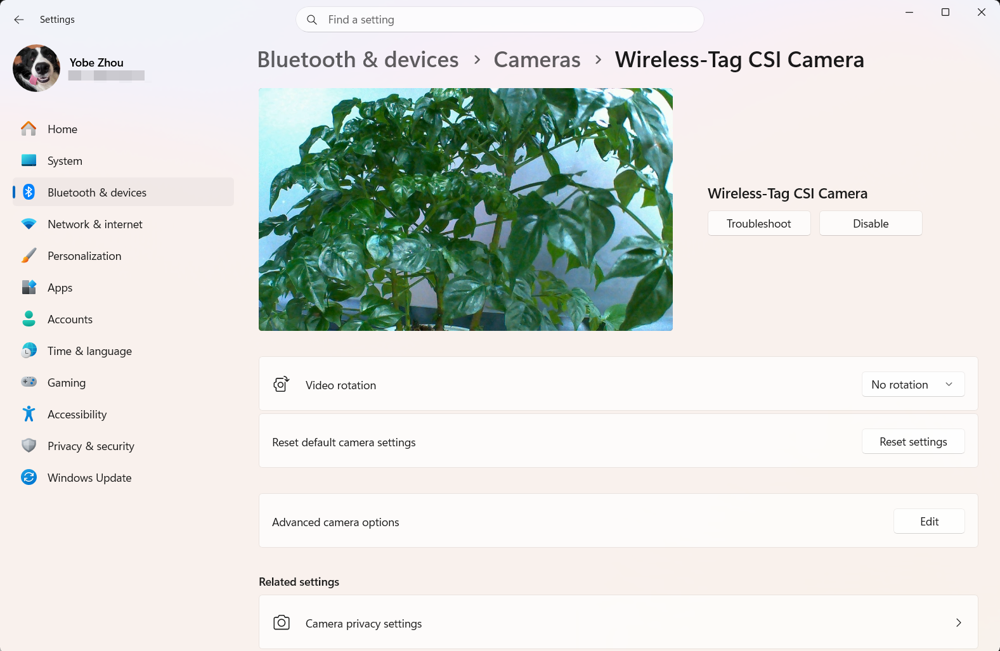

| 支持目标 | WT9932P4-TINY | WT9932P4C61-TINY |
| -------- | ------------- | ---------------- |

# USB Device UVC 摄像头示例

本示例将 WT9932P4-TINY 或 WT9932P4C61-TINY 上连接的 SC2336 MIPI CSI 摄像头模拟为 High-Speed USB UVC MJPEG 摄像头。电脑无需专用驱动即可通过系统相机、OBS 等兼容 UVC 的软件获取画面。

摄像头采集、硬件 JPEG 编码和 USB Device UVC 的初始化都由 `wt_bsp_init()` 触发，并由板级 `board_init()` 管理生命周期。应用层不直接使用板级私有头文件或引脚定义。

## 硬件连接

1. 将 SC2336 摄像头连接到开发板 MIPI CSI 接口。
2. 使用 FUSB 接口烧录 ESP32-P4 固件和查看串口日志。
3. 固件启动后，将 HUSB 接口连接到电脑。

两块支持板卡的 IO0 都连接到摄像头 PWDN/LDO/RESET 控制路径，BSP 会在检测摄像头前自动将 IO0 拉高。

## 编译

加载 ESP-IDF v6.0.1 环境后，在仓库根目录运行：

```shell
WT_BSP_BOARD=WT9932P4C61-TINY idf.py \
    -C examples/camera/usb_device_uvc \
    -B build-usb-device-uvc-p4c61 \
    build
```

使用 WT9932P4-TINY 时选择对应板级配置：

```shell
WT_BSP_BOARD=WT9932P4-TINY idf.py \
    -C examples/camera/usb_device_uvc \
    -B build-usb-device-uvc-p4 \
    build
```

也可以进入示例目录，执行 `idf.py set-board` 并选择任一受支持板卡，然后运行 `idf.py build`。

默认配置为：

- High-Speed USB Device
- UVC MJPEG
- 1024x600 @ 30 FPS
- JPEG 压缩质量 80
- 正常运行时 RGB LED 熄灭，摄像头初始化失败时常亮红灯

可在以下 menuconfig 路径关闭板级 UVC 初始化：

```text
WT BSP
└── Enable USB Device UVC
```

## 运行效果

正常启动后，电脑会枚举出名为 `Wireless-Tag CSI Camera` 的摄像头。串口日志类似：

```text
I (...) usb_device_uvc: Initializing Wireless-Tag BSP
I (...) wt_bsp_csi: CSI initialized successfully
I (...) usbd_uvc: UVC Device Start, Version: 1.3.1
I (...) board_usb_uvc: USB Device UVC ready: MJPEG 1024x600@30fps
I (...) usb_device_uvc: USB Device UVC is ready. Connect HUSB to the USB host.
I (...) usbd_uvc: Mount
```

### 预期警告

正常运行期间可能出现以下警告，它们不表示摄像头或 UVC 功能异常：

```text
W (...) board: Display device not found at address: 0x28
W (...) board: Touch device not found at address: 0x55
```

BSP 会扫描共享 I2C 总线上的可选显示屏、触摸控制器和摄像头。仅连接 SC2336 摄像头时，未检测到显示屏和触摸控制器属于正常现象。只要在地址 `0x30` 检测到摄像头，摄像头初始化就可以继续。

```text
W (...) usb_phy: Using UTMI PHY instead of requested internal PHY
```

ESP-IDF 会为 ESP32-P4 的 High-Speed USB Device 模式选择 UTMI PHY。这是预期的兼容处理，不会降低配置的 UVC 速度。

在支持 ISP AWB 子窗口的 ESP32-P4 芯片版本上，使用 1024x600 视频流时还可能在推流期间重复出现以下警告。本示例默认会在运行时屏蔽 `ISP_AWB` tag；如果移除该过滤设置，或在其他应用中使用 BSP，则仍可能看到该警告：

```text
W (...) ISP_AWB: subwindow size (1024 x 600) is not divisible by AWB subwindow blocks grid (5 x 5).
             Resolution will be floored to the nearest divisible value.
```

该警告仅影响 ISP 自动白平衡的内部统计窗口。由于窗口宽度必须能被 5x5 AWB 网格整除，ESP-IDF 会将内部统计窗口从 1024x600 对齐为 1020x600。摄像头采集、JPEG 编码和 USB UVC 输出仍保持 1024x600。使用 `esp_video` 2.3.x 时，AWB 参数可能逐帧重新配置，因此同一条非致命警告可能按接近视频帧率的频率重复打印。

不要仅为了消除该警告而把 UVC 分辨率修改为 1020x600。如果电脑能够稳定接收画面，并且日志显示 CSI、UVC 和视频流均已成功启动，则不需要处理该警告。

### Windows 查看效果

在 Windows 11 中打开 **设置 > 蓝牙和设备 > 摄像头**，选择 `Wireless-Tag CSI Camera`，即可查看如下图所示的实时画面：



> 该截图拍摄于自定义 UVC 接口名称生效前。使用当前固件时，截图中的 `UVC CAM1` 会显示为 `Wireless-Tag CSI Camera`。
>
> 注意：上图使用 WT9932P4C61-TINY 开发板拍摄。该开发板使用 ESP32-P4 v3.x 芯片，摄像头画面经过 ISP 处理。WT9932P4-TINY 使用 ESP32-P4 v1.x 芯片，本示例不进行 ISP 处理，因此显示效果会相对差一些。

## 说明

- USB UVC 模式独占 CSI 采集设备，应用不要再调用 `wt_bsp_csi_start()`。
- `wt_bsp_get_csi()` 返回 `NULL` 时表示摄像头未启用、未检测到或初始化失败。
- `CONFIG_WT_BSP_ENABLE_USB_DEVICE_UVC` 关闭后，BSP 不会初始化 USB Device UVC。
